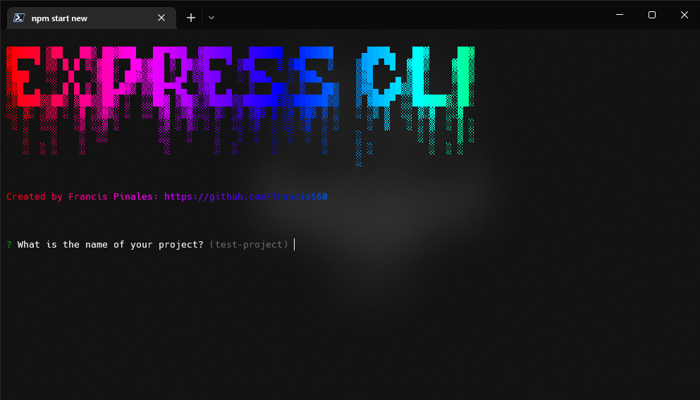

<p align="center">
  <br>
  
  <br>
  <br>
</p>

# Express Cli Ultimate

An easier way to build your project structure in express.


## Development Setup


### Prerequisites

- Install [Node.js] which includes [Node Package Manager][npm]

### Setting Up a Project

Install the Express cli ultimate globally:

```
npm install -g express-cli-ultimate
```

Create workspace:

```
ecu new
```

Run the application:

```
cd [PROJECT NAME]
npm i
npm run dev
```

**Love Express Cli Ultimate? Give our repo a star :star: :arrow_up:.**